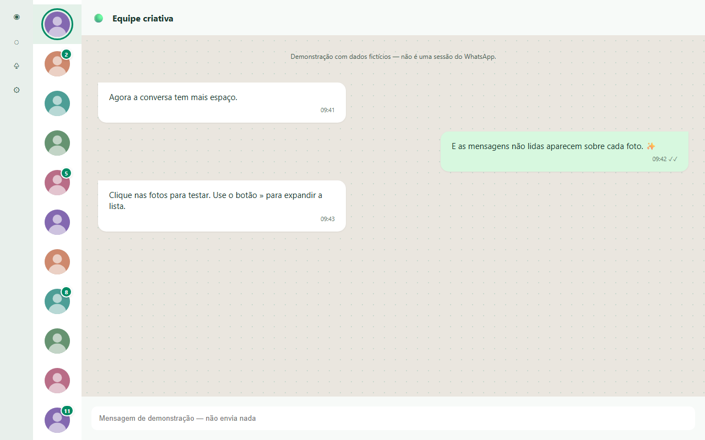

# WhatsApp Compact Sidebar

Extensão pessoal para deixar a lista de conversas do WhatsApp Web estreita, com avatares e contadores de mensagens não lidas sobre as fotos. Mais espaço para a conversa aberta.

**Versão 0.2.0 — experimental.** Em uso no WhatsApp Web real (Chrome, tema escuro) desde outubro de 2026, além dos testes automáticos numa simulação com dados fictícios. Não é uma extensão oficial da Meta/WhatsApp.



## Instalar no Chrome (também funciona em navegadores Chromium, como Brave)

1. Baixe o repositório em **Code → Download ZIP** e extraia, ou use a pasta local do projeto.
2. No Chrome, digite `chrome://extensions` na barra de endereço. No Brave, use `brave://extensions`.
3. Ative **Modo do desenvolvedor**, no canto superior direito.
4. Clique em **Carregar sem compactação** (Load unpacked).
5. Selecione a pasta **extension** deste projeto — é a pasta que contém `manifest.json`.
6. Abra ou recarregue `https://web.whatsapp.com/`.
7. No menu de extensões (ícone de quebra-cabeça), fixe **WhatsApp Compact Sidebar** para acessar as opções.

Não é necessário instalar Node, executar comandos ou pagar para usar. Mantenha a pasta no mesmo lugar depois de instalar. Instale no navegador em que você usa o WhatsApp.

## Usar

- A lateral fica **sempre compacta**, com 88 px, em qualquer tamanho de janela. Clique numa foto para abrir a conversa.
- O contador mostra o indicador de não lidas já fornecido pelo WhatsApp (não é uma notificação do sistema operacional). Quando não há quantidade, aparece uma bolinha.
- Passe o mouse para ver o nome do contato e o indicador de não lidas.
- O cabeçalho da lista (título, nova conversa e menu ⋮), a pesquisa e os filtros ficam escondidos. Não há botão de expandir: para pesquisar, filtrar ou iniciar uma conversa nova, desmarque **Ativar extensão** no ícone dela e marque de novo depois.
- No ícone da extensão, altere a largura (80, 88 ou 104 px) ou desative a personalização.
- A barra nativa de navegação por ícones permanece disponível.
- Em listas não reconhecidas ou vazias, o layout original é preservado.

## Privacidade

O código roda somente em `https://web.whatsapp.com/*`. A única permissão adicional é `storage`, para salvar ativação, modo e largura no navegador. Não há servidor, IA, telemetria, cookies lidos pela extensão ou envio de conversas. Nomes, fotos e indicadores já presentes na lista são usados apenas para a apresentação local. Não guardamos contatos nem mensagens. Fotos usam as mesmas URLs já presentes na página.

## Limitações e recuperação

O WhatsApp não oferece um contrato público estável para alterar seu layout. Mudanças no HTML podem exigir manutenção em `SELECTORS` e `findColumn`, no arquivo `extension/content.js`. Os indicadores de não lidas reconhecem português, inglês e espanhol, além de alguns identificadores estruturais.

Não modificamos a altura, a ordem ou os eventos das linhas nativas, para preservar a rolagem virtualizada e os cliques. O layout é recolhido somente quando a lista e os avatares são reconhecidos. Isso reduz, mas não elimina, incompatibilidades com futuras versões.

Estrutura do WhatsApp Web considerada (outubro de 2026): a coluna da lista empilha na vertical o cabeçalho (`data-testid="chatlist-header"`) e o `#side`; só a coluna externa recebe a largura fixa via `flex-basis`, senão ela viraria a altura da lista. O painel `data-testid="drawer-middle"` fica sobre a conversa e tem a borda esquerda escondida no modo compacto, para não aparecer como um risco vertical.

Se o layout quebrar depois de uma atualização do WhatsApp, o jeito mais rápido de diagnosticar é olhar a estrutura da página (tags, `id`, `role`, `data-testid`, posição e tamanho dos ancestrais de `#side` e das linhas) no console do navegador e comparar com `tests/fixture.html`.

Se algo ficar estranho: desative a extensão no painel e recarregue a página. Para remover, vá a `chrome://extensions`, clique em **Remover** e recarregue o WhatsApp. Após atualizar os arquivos, clique em **Recarregar** no cartão da extensão e recarregue também o WhatsApp.

## Desenvolvimento

Extensão Manifest V3, JavaScript e CSS sem bibliotecas em tempo de execução.

```sh
npm install
npx playwright install chromium
npm run check
npm test
```

Os testes usam Chromium em modo headless, sem acessar uma conta do WhatsApp. Verificam dimensões, cliques nativos, contadores dinâmicos, reciclagem de linhas, alternância, largura, telas estreitas, desativação e opções. Capturas ficam em `test-results/` e não são versionadas.

Estrutura:

- `extension/`: arquivos prontos para instalar, sem compilação.
- `tests/fixture.html`: simulação com contatos e mensagens fictícias, seguindo a estrutura real do WhatsApp Web (cabeçalho fora do `#side`, coluna vertical, painel `drawer-middle`).
- `tests/extension.test.mjs`: testes de comportamento.
- `scripts/package.mjs`: copia os arquivos para `dist/extension` com `npm run package`.

Já validado no WhatsApp real: lista compacta com fotos, troca de conversa e tema escuro. Ainda falta conferir: grupos sem foto, recebimento de mensagens e contadores ao vivo, conversas arquivadas, filtros, pesquisa, rolagem longa, tema claro e o painel de dados do contato aberto.

## Histórico

- **0.2.0** — Lista sempre compacta: saem o botão de expandir/recolher, o atalho Alt + Shift + C, a opção "Mostrar só as fotos" e o corte em janelas menores que 700 px (que desfazia o layout ao diminuir ou minimizar a janela).
- **0.1.1** — Corrige o layout no WhatsApp Web atual: a lista ficava com 88 px de altura (só uma foto aparecia), o cabeçalho com o botão de nova conversa vazava por cima do chat e aparecia um risco vertical no meio da conversa.
- **0.1.0** — Primeira versão: lateral compacta com avatares, contadores de não lidas, atalho Alt + Shift + C e painel de opções.
